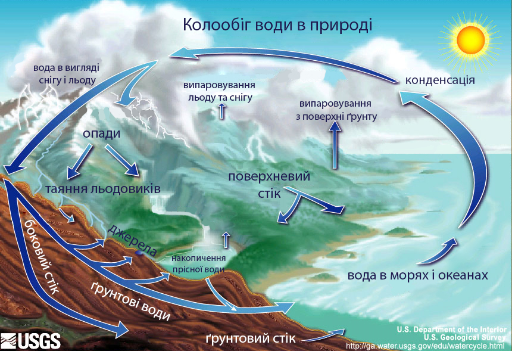

Свiтовий колообiг води
======================

На Землі водночас відбуваються великий і малий колообіги води.

Процес переміщення води на земній кулі — великий (світовий) колообіг води в природі:

океан – атмосфера – суходіл – океан

Спочатку вода випаровується з океанів, морів, річок тощо. Піднімаючись
угору, водяна пара охолоджується і знову перетворюється на рідину. Потім
ця рідина випадає на землю дощем, градом, а взимку – снігом. Будь-які
атмосферні опади стікають по земній поверхні, приміром, у річки, озера,
а частина їх просочується в землю. З часом вода знов повертається в
океан.

Трапляється, що вода, яка випаровується з поверхні океану, повертається
у вигляді атмосферних опадів одразу в той самий океан. Це малий колообіг води в природі: 

океан – атмосфера – океан

