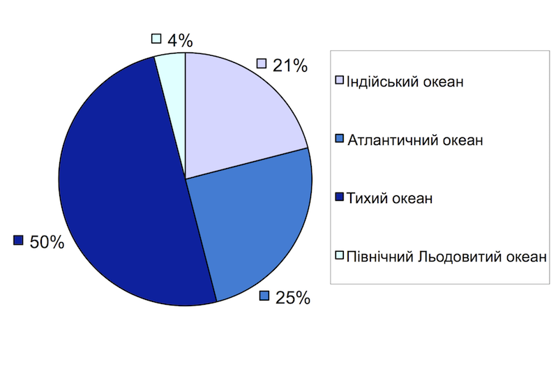

Свiтовий океан та його частини
==============================

Визначення

<b>Свiтовий океан</b> — безперервний водний простiр земної кулi поза суходолом.

Площа Світового океану — 361 млн км$$^{2}$$ (71% усієї земної поверхні; $$\dfrac{3}{4}$$ території Землі, і лише $$\dfrac{1}{4}$$ її поверхні припадає на суходіл). У Світовому океані зосереджено 96,5% усіх вод Землі, тому його вважають найголовнішою частиною гідросфери. Поверхню Світового океану називають акваторією.

Світовий океан поділяють на <u>чотири</u> океани:
<ul>
<li>Тихий (найбільший і найглибший)
<li>Атлантичний (найбільш освоєний, найсолоніший і найбільш забруднений)</li>
<li>Індійський (найтепліший)</li>
<li>Північний Льодовитий (найменший, наймілкіший, найхолодніший).</li>
</ul>

Визначення

<b>Моря</b> — частини океанiв, як i глибоко заходять у сушу або вiдокремленi вiд океанiв островами i пiвостровами.

Розрізняють окраїнні, середземні та міжострівні моря.

Окраїнні моря розміщуються по окраїнах материків і мало вдаються в суходіл. Наприклад, Аравійське в Індійському океані, Берингове в Тихому океані.

Середземні моря розташовуються всередині материка або між материками і з’єднуються з океаном однією або кількома протоками. Наприклад, Чорне, Середземне і Азовське в Атлантичному океані.

Міжострівні моря розміщуються між островами. Наприклад, Яванське, Банда в Тихому океані.

Визначення

<b>Затока</b> — частина океану або моря, що глибоко вдається у суходiл, але має вiльний зв’язок з океаном.

В окремих випадках назва затока історично закріпилася за такими частинами Світового океану, що є, по суті, морями, як, наприклад, Мексиканська, Гудзонова або Перська затоки.

Означення

<b>Протока</b> — вiдносно вузька частина водного простору, що сполучає двi сусiднi водойми i роз’єднує дiлянки суходолу.

Наприклад

Ґібралтарська, Керченська, Босфор, Магелланова протоки.

<quiz>
<question>

Який океан найсолоніший?

<answer>Тихий океан</answer>
<answer>Індійський океан</answer>
<answer>Північний Льодовитий океан</answer>
<answer correct>Атлантичний океан</answer>
</question>
<question>

Що є назвою затоки?

<answer>Дрейка</answer>
<answer>Босфор</answer>
<answer>Беригнова</answer>
<answer correct>Гудзонова</answer>
</question>
<question>

Як називаються частини океану, які розміщуються по окраїнах материків і мало вдаються в суходіл?

<answer>затоки</answer> 
<answer>протоки</answer> 
<answer>середземні моря</answer> 
<answer correct>окраїнні моря</answer>
</question>
</quiz>
