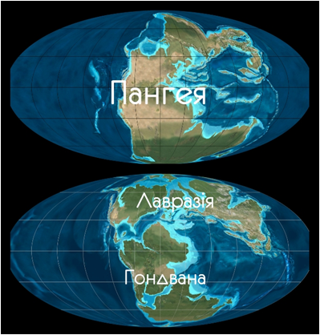

Утворення материків та океанів
==============================

Понад півмільярда років тому існував тільки один материк — Пангея (з грецьк. – «вся земля») та один єдиний океан. Потім, внаслідок руху літосферних плит, материк Пангея розколовся, і в Північній півкулі виник материк Лавразія (нинішня Євразія і Північна Америка). Водночас у Південній півкулі утворився материк Гондвана (сучасні території Антарктиди, Австралії, Африки, Південної Америки і частини Південної Азії). Близько 250 млн років тому Гондвана розпалася на окремі частини, які поступово стали сучасними материками Південної півкулі — Африки, Австралії, Південної Америки та Антарктиди. Лавразія також розкололася на теперішні Північну Америку та Євразію. Водночас з утворенням сучасних материків почали формуватися й улоговини нинішніх океанів.

<quiz>
<question>

Укажіть назви материків, які утворилися в результаті розколу Гондвани.

<answer>Євразія та Північна Америка</answer>
<answer correct>Антарктида, Австралія, Африка, Південна Америка</answer>
<answer>Євразія, Північна Америка, Австралія й Африка</answer>
<answer>Південна та Північна Америка</answer>
</question>
</quiz>
