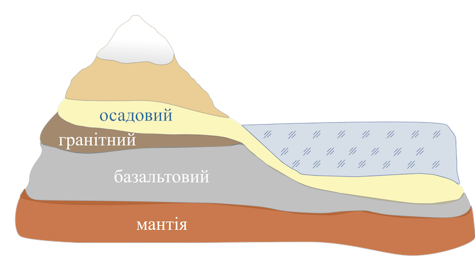

Внутрiшня будова Землi
======================

Земля має складну внутрішню будову. Вона має три основні оболонки:

<ul>
<li>внутрішній шар — ядро</li>
<li>проміжний шар — мантія</li>
<li>зовнішній шар — земна кора</li>
</ul>

Ядро (33,5 % загальної маси планети) розташоване в центрі Землі.
Розташовано ядро на глибині 2900-6371 км. Радіус ядра становить 3500 км.
Його склад та особливості ще до кінця не визначені. Припускають, що
зовнішнє ядро рідке, а внутрішнє складає тверду частину ядра.
Температура в ядрі, ймовірно, сягає 5000$^{\circ}$С.

Мантія (66 % загальної маси планети) – оболонка Землі, що
розташована під земною корою та простягається приблизно до глибини 2900
км, тобто до ядра. Породи переважно у твердому стані при температурі
понад 1300$^{\circ}$С, але у верхній частині мантії розташована
астеносфера — в’язкий шар, де температура сягає таких значень, що
тверда речовина починає плавитися.

Земна кора (0,5 % усієї нашої планети) — тверда шарувата оболонка
Землі товщиною від 5 км під океанами до 70 км під гірськими масивами
материків.

Верхній шар земної кори складається з пухких осадових відкладів. Через
це він дістав назву осадовий. Наступний під осадовим шар утворений з
кристалічних гірських порід, близьких за складом до гранітів. Тому його
називають гранітний. Найнижчий шар складається переважно з порід,
близьких за своїми властивостями до базальтів. Його називають
базальтовим.

Земна кора поділяється на материкову та океанічну.

<table>
<thead>
<tr>
<th>Материкова земна кора</th>
<th>Океанiчна земна кора</th>
</tr>
</thead>
<tbody>
<tr>
<td>Складається із <b>трьох</b> шарів гірських порід: осадовий, гранітний, базальтовий</td>
<td>Складається із <b>двох</b> шарів гірських порід: осадовий та базальтовий</td>
</tr>
<td colspan="2">

</td>
</tr>
<tr>
<td>Має товщину 35-70 км</td>
<td>Має товщину 5-15 км</td>
</tr>
</tbody>
</table>