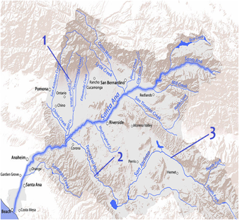
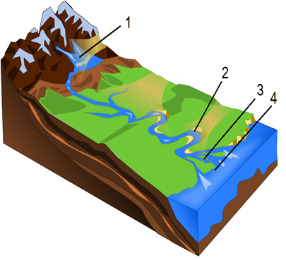

Води суходолу
=============

Означення

<b>Води суходолу</b> — води рiк, озер, болiт, льодовикiв, штучних водойм, каналiв.

<b>Рiчка</b> — природний водний потiк, що рухається в заглибленнi, створеному його рухом.
Рiчкова долина</b> — пониження від витоку до гирла, по якому тече річка.

Означення

<b>Рiчкова система</b> — головна рiчка з притоками.

Якщо стати лицем за течією річки, справа буде права притока, відповідно,
ліва – з протилежної сторони.

<b>Притоки річки:</b> 1 – права, 2 – ліва притока першого порядку, 3 – ліва притка другого порядку

Автор: Shannon1

**Частини річки:**

-   **Витік** – початок річки (може бути джерело, болото,
    льодовик тощо).

-   **Гирло** – кінець річки, де вона в впадає в іншу річку, озеро,
    море тощо.

-   **Русло** – заглиблення у річковій долині, по якому постійно течуть
    води річки.

-   **Заплава** – частина річкової долини, яка затоплюється під
    час повені.

-   **Тераси** – східцеподібні уступи на берегах річки, які колись
    були заплавами.

-   **Дельта** – рівнина в пониззях річки, створена наносами річки та
    порізана протоками.

-   **Поріг** – мілководна скеляста ділянка в руслі річки.

-   **Водоспад** – круте падіння води з прямовисного уступу в
    русло річки.

Означення

<b>Басейн рiчки</b> — територiя, з якої рiчка з притоками збирає поверхневi та пiдземнi води.

<b>Вододiл</b> — межа мiж басейнами сусiднiх рiчок.

<b>Схема річки:</b> 1 – витік, 2 – меандр, 3 – дельта, 4 – гирло

Автор: Distorted

Означення

<b>Режим рiчки</b> — змiна рiвня води в рiчцi протягом року.

<b>Повiнь</b> — тривале перiодичне пiдняття рiвня води в рiчцi.

<b>Паводок</b> — короткочасне пiдняття рiвня води в рiчцi.

<b>Межень</b> — найнижчий рiвень води в рiчцi.

<b>Льодостав</b> — час, коли рiчка покрита льодом.

<b>Льодохiд</b> — схiд льоду з рiчки.

Живлення рiчки — постiйне поповнення рiчки водами.

**Живлення річок:**

-   Снігове

-   Дощове

-   Льодовикове

-   Підземними водами

-   Змішане

Більшість річок суходолу живляться за змішаним типом із переважанням
одного з джерел живлення. У річок з переважанням льодовикового живлення
повінь влітку, снігового – навесні (річки помірних широт).

**За характером течії:**

-   Гірські (мають пряме русло, вузьку долину та швидку течію)

-   Рівнинні (мають русло з вигинами, широку долину та плавну течію)

Руйнівну роботу ріки називають ерозією.

Означення

<b>Меандри</b> — плавнi колоподiбнi вигини русла рiчки.

У такому меандрі річка тече швидше вздовж увігнутого берега, розмиваючи
його. Тому закрути постійно збільшуються, доки не відбудеться їхній
прорив. Тоді частина колишнього русла залишається збоку, поступово
замулюється й утворює старичне озеро – старицю.

Форми рельєфу утворюються також тимчасовими потоками вод.

Означення

<b>Яри</b> — глибокi, широкi й достатньо протяжнi крутосхилi долини V-подiбної
форми, якi виникають внаслiдок ерозiї пухких гiрських порiд тимчасовими лiнiйними водотоками пiд час потужних опадiв, танення снiгу, льоду чи льодовикiв.

<b>Балка</b> — суха або з тимчасовим водотоком долина з плоским дном; кiнцева
стадiя розвитку ярiв.

