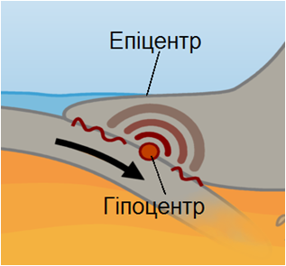
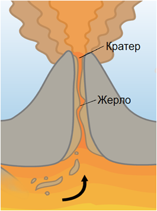

Вплив внутрішніх сил Землі
==========================

Означення

<b>Сейсмологiя</b> — наука, яка вивчає землетруси.

Найнебезпечніші осередки вогнищ землетрусів:
<ul>
<li>Середземноморсько-Гімалайський сейсмічний пояс (в Євразії)</li>
<li>Тихоокеанський сейсмічний пояс (навколо Тихого океану)</li>
</ul>

Землетруси на узбережжі Тихого океану небезпечні ще й тим, що майже завжди супроводжуються велетенськими хвилями — цунамі.

Означення

<b>Землетруси</b> — це швидкi коливання земної кори, що вiдбуваються внаслiдок визволення величезної енергiї, яка накопичується в надрах планети.

Ці коливання призводять до розривів і зміщень пластів у глибинах земної кори і навіть у верхній частині мантії. Місце розривів і зміщень у земній корі, яке може виникнути на різній глибині, називають
гіпоцентром (вогнищем землетрусу). Ділянку на поверхні Землі, розташовану над гіпоцентром, називають епіцентром землетрусу.

В епіцентрі інтенсивність поштовхів найбільша, а з віддаленням від нього інтенсивність зменшується. Інтенсивність землетрусів вимірюють у балах за дванадцятибальною шкалою.

Означення

<b>Вулканiзм</b> — це пiднiмання з надр Землi та виверження на її поверхню розплавленої речовини мантiї — магми.

<b>Магматизм</b> — це сукупнiсть процесiв виплавляння, розвитку, руху та застигання магми.

<b>Вулкан</b> — геологiчне утворення, що виникає пiд час вулканiзму.

Вулкани, як і землетруси, як правило, виникають на межах літосферних плит унаслідок рухів земної кори. Пояси землетрусів і вулканізму здебільшого збігаються. Тихоокеанський сейсмічний пояс навіть називають вогняним кільцем через рекордну кількість вулканів. Виверження вулкана супроводжується сильними вибухами, виверженням разом із лавою суміші газів, попелу, водяної пари, великих уламків гірських порід (вулканічних бомб). Під впливом часу із шарів застиглої лави формуються вулканічні гори.

Вулкани бувають:

-   Згаслі

-   Діючи

Згаслі — це ті, про виверження яких не збереглось ніяких відомостей.
Про їхню вулканічну природу свідчать конусоподібна форма гори та кратер на вершині.

Діючі — це ті вулкани, про виверження яких є достовірні свідчення.

Гарячі джерела та гейзери — виходи на земну поверхню підземних вод, пов’язані з вулканізмом.

Вони нагріваються від розпеченої магми, яка підходить близько до поверхні. Зазвичай температура води у них сягає 50-90$^{\circ}$С.
Найбільше гарячих джерел і гейзерів в Ісландії — близько 700. Є вони у Росії (на Камчатці) та у США (Єллоустонський національний парк).

Гарячі джерела — спокійне витікання води з тріщин земної кори.

Гейзери — це джерела, які під тиском пари викидають фонтани гарячої води.