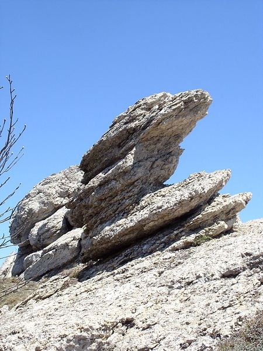
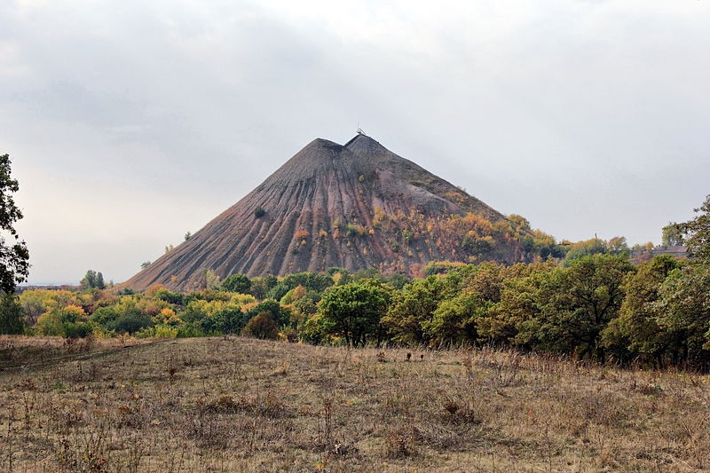

Вплив зовнішніх сил Землі
=========================
На рельєф земної поверхні також впливають і зовнішні процеси, які відбуваються під впливом сонячної радіації, сили ваги, діяльності живих організмів та людини. Вони сприяють утворенню ярів, балок, річкових долин, печер, горбів і пасом різної форми.

Означення

<b>Вивiтрювання</b> — процес руйнування i змiни гiрських порiд на земнiй поверхнi пiд впливами коливань температури повiтря, води й органiзмiв.

<i>Рисунок 5.8.1:  Вивiтрювання. Ялтинська Яйла</i>

Означення

<b>Фiзичне вивiтрювання</b> — руйнування мiнералiв i гiрських порiд пiд впливом <i>сонячної енергiї</i>.

Різких змін температури повітря не витримують навіть дуже тверді гірські породи. Вони то розширюються під час нагрівання, то стискаються внаслідок охолодження. Через це відламуються великі брили, уламки яких поступово перетворюються на щебінь, пісок і пил. Саме під дією фізичного вивітрювання каміння у пустелі Сахара «кричить».

Означення

<b>Хiмiчне вивiтрювання</b> — руйнування, розчинення й перетворення мiнералiв i гiрських порiд, яке вiдбувається внаслiдок хiмiчної дiї води

<b>Органiчне вивiтрювання</b> — руйнування, розчинення й перетворення мiнералiв i гiрських порiд, яке вiдбувається в результатi дiяльностi живих органiзмiв.

Діяльність води створює річкові долини, водоспади, каньйони, яри, печери.

Живі організми перетворюють мінеральну речовину на органічну, а після відмирання організмів, навпаки, органічні речовини перетворюються на мінеральні. Крім того, в земній корі тварини утворюють численні порожнини (нори й горбики). На болотах завдяки рослинам часто виникають купини. У теплих тропічних морях внаслідок накопичення відмерлих вапнякових коралів утворюються коралові рифи.

У результаті діяльності людини утворюються антропогенні форми рельєфу. До рукотворних форм рельєфу належать *терикони* (штучні «гори» насипані з порожніх порід, які викопували під час розробки родовищ корисних копалин), шахти, кар’єри, кургани (штучні куполоподібні горби в місцях давніх поховань), підземні переходи, тунелі, мости, насипи, піраміди, канали тощо. Великий внесок у формування рельєфу належить роботі вітру. Вітер створює форми рельєфу, які нагадують колони, стовпи, гриби, також ніші в горах. Увесь подрібнений матеріал вітер переносить на великі відстані і відкладає, створюючи, зокрема,
бархани (піщані горби серпоподібної форми заввишки 200—500 м (у пустелях)) і дюни (піщані горби, вали та пасма, нанесені вітром, заввишки 100 м (на піщаних берегах морів, озер, річок)).
