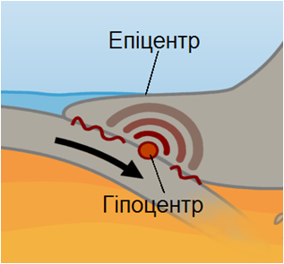

# Землетруси

Визначення

<b>Сейсмологiя</b> — наука, яка вивчає землетруси.

Найнебезпечніші осередки вогнищ землетрусів:
<ul>
<li>Середземноморсько-Гімалайський сейсмічний пояс (в Євразії)</li>
<li>Тихоокеанський сейсмічний пояс (навколо Тихого океану)</li>
</ul>

Землетруси на узбережжі Тихого океану небезпечні ще й тим, що майже завжди супроводжуються велетенськими хвилями — цунамі.

Визначення

<b>Землетруси</b> — це швидкi коливання земної кори, що вiдбуваються внаслiдок визволення величезної енергiї, яка накопичується в надрах планети.

Ці коливання призводять до розривів і зміщень пластів у глибинах земної кори і навіть у верхній частині мантії. Місце розривів і зміщень у земній корі, яке може виникнути на різній глибині, називають
гіпоцентром (вогнищем землетрусу). Ділянку на поверхні Землі, розташовану над гіпоцентром, називають епіцентром землетрусу.

В епіцентрі інтенсивність поштовхів найбільша, а з віддаленням від нього інтенсивність зменшується. Інтенсивність землетрусів вимірюють у балах за дванадцятибальною шкалою.

На узбережжі Тихого океану землетруси часто супроводжуються  велетенськими хвилями – цунамі, які в довжину бувають до 500 м, а висота хвилі може досягати 30-40 метрів. Під час цунамі рухається лише приповерховий шар води. 