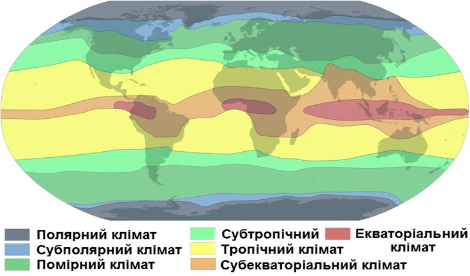

Клiмат Землi, чинники його формування, пояси та основнi типи
============================================================

Визначення

<b>Клiмат</b> — це багаторiчний режим погоди в межах певної територiї.

Клімат залежить від географічної широти певної території, відстані від морів та океанів, характеру морських течій, висоти над рівнем океану, особливостей рельєфу.

<table>
<thead>
<tr>
<th colspan="2">Клiматографiчнi чинники:</th>
</tr>
</thead>
<tbody>
<tr>
<td><b>Сонячна радіація</b></td>
<td>Чим більший кут падіння сонячних променів, тим
більшу кількість сонячного тепла отримує місцевість.</td>
</tr>
<tr>
<td><b>Циркуляція повітряних мас</td> 
<td>Завдяки циркуляції відбувається перенесення тепла й вологи між широтами та між материками й океанами.</td>
</tr>
<tr>
<td><b>Характер підстилаючої поверхні</b></td>
<td>Особливості рельєфу, льодовиковий, сніговий і рослинний
покрив, висота над рівнем моря, водна поверхня або суша, напрямок
хребтів, океанічні течії. Від висоти над рівнем моря залежить те, як
зміняться атмосферний тиск, температура повітря і кількість опадів.
Теплі течії переносять з низьких широт до високих велику кількість
тепла, а холодні, навпаки, з високих широт до низьких – холоднечу.</td>
</tr>
<tr>
<td><b>Географічне положення території</b></td>
<td>Від того, внутрішня це частина материка чи узбережжя,
залежить континентальність клімату — зменшення річної кількості опадів
та збільшення амплітуди коливання річної температури.</td>
</tr>
</tbody>
</table>

Визначення

<b>Тип клiмату</b> — сукупнiсть клiматичних показникiв для певної територiї.

<b>Клiматичнi пояси</b> — величезнi територiї, в межах яких основнi
показники клiмату майже однаковi.

<b>Клiматична область</b> — частина клiматичного поясу, над якою
панують певнi повiтрянi маси.

<b>Клiматичнi карти</b> — географiчнi тематичнi карти, на яких за допомогою умовних знакiв показано особливостi певної територiї. Цi карти складають за результатами багаторiчних спостережень.

<i>Карта кліматичних поясів</i>

В основу виділення кліматичних поясів учений-кліматолог Борис Алісов поклав назви панівних типів повітряних мас. Виділяють 13 кліматичних поясів, які майже симетрично змінюються щодо екватора. Помірний, субтропічний і тропічний кліматичні пояси поділяються на кліматичні області, що формуються завдяки чергуванню на земній поверхні материків та океанів.

<b><u>Кліматичні пояси бувають:</u></b>

Основні — характеризуються пануванням протягом року одного типу повітряних мас: екваторіальний, два тропічні, два помірні, арктичний, антарктичний.

Перехідні — характеризуються зміною повітряних мас двічі на рік: два субекваторіальні, два субтропічні, субарктичний, субантарктичний.

<table>
<thead>
<tr>
<th colspan="3">Клiматографiчнi чинники:</th>
</tr>
</thead>
<tbody>
<tr>
<td><b>Екваторiальний</b></td>
<td>Панують екваторiальнi повiтрянi маси. Переважають висхiднi рухи повiтря.</td>
<td>Низький атмосферний тиск.
Високi середнi температури повiтря ($$+26$$ ...$$+28^{\circ}$$С) протягом року. Велика кiлькiсть опадiв (2000-3000 мм на рiк).</td>
</tr>
<tr>
<td><b>Субекваторiальний</b></td>
<td>Улiтку панують екваторiальнi повiтрянi маси, взимку — тропiчнi.</td>
<td>Два чiтко вираженi клiматичнi сезони: вологий (панують екваторiальнi повiтрянi маси) та сухий (переважають тропiчнi повiтрянi маси).</td>
</tr>
<tr>
<td><b>Тропiчний</b></td>
<td>Панують тропiчнi повiтрянi маси. Переважають низхiднi
рухи повiтря. Переважнi вiтри – пасати.</td>
<td>Високий атмосферний тиск. Високi середнi температури повiтря (улiтку $$+30^{\circ}$$С, взимку $$+15$$ ...$$+16^{\circ}$$С). Мiнiмальна кiлькiсть опадiв, якi розподiляються нерiвномiрно.</td>
</tr>
<tr>
<td><b>Субтропiчний</b></td>
<td>Улiтку панують тропiчнi повiтрянi маси, взимку — помiрнi.</td>
<td>Змiна клiматичних сезонiв: лiто сухе i жарке, зима прохолодна й волога.</td>
</tr>
<tr>
<td><b>Помiрний</b></td>
<td>Панують помiрнi повiтрянi маси. Переважають захiднi
вiтри. Утворюються фронтальнi процеси, циклони, антициклони.</td>
<td>Чiтко вираженi чотири пори року. Значнi амплiтуди
температур найтеплiшого й найхолоднiшого мiсяцiв року. Кiлькiсть опадiв залежить вiд вiддаленостi територiї вiд океану. У цих поясах, особливо в пiвнiчному,
видiляють кiлька рiзновидiв клiмату: морський, континентальний, рiзкоконтинентальний та мусонний, що пов’язано з розташуванням територiї на узбережжi чи всерединi материка.</td>
</tr>
<tr>
<td><b>Субарктичний (субантарктичний)</b></td>
<td>Улiтку панують помiрнi повiтрянi маси, взимку —
арктичнi (антарктичнi).</td>
<td>Лiто коротке, вiдносно вологе, прохолодне, зима сувора й суха.</td>
</tr>
<tr>
<td><b>Арктичний та антарктичний</b></td>
<td>Арктичнi (антарктичнi) повiтрянi маси.
Переважають пiвнiчно-схiднi
(пiвденно-схiднi) вiтри.</td>
<td>Високий атмосферний тиск. Вiд’ємнi середнi температури повiтря протягом року. Незначна кiлькiсть опадiв. Сталий снiговий покрив.</td>
</tr>
</tbody>
</table>