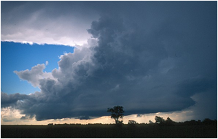

# Купчасті хмари

Купчасті і купчасто-дощові хмари з’являються влітку. Це білі
хмари, які поступово ростуть угору, темніють і можуть розрядитися
зливою.

Автор: Gebruiker:RobotE

<quiz>
<question>

Установіть відповідність між видом хмар та їх описом 
Низькі, потужні, часто мають сіре чи темне забарвлення і нагадують туман. Ці хмари є змішаними і складаються як з краплинок води, так і з кристаликів льоду. З них випадають затяжні дощі, мряка, сніг

<answer>Перисті хмари</answer>
<answer correct>Шаруваті та шарувато-дощові хмари</answer>
<answer>Купчасті і купчасто-дощові хмари</answer>
</question>
<question>

Білі хмари, як і поступово ростуть угору, темніють і можуть розрядитися зливою. З’являються улітку

<answer>Перисті хмари</answer>
<answer>Шаруваті та шарувато-дощові хмари</answer>
<answer correct>Купчасті і купчасто-дощові хмари</answer>
</question>
<question>

Мають вигляд білих смужок. Вони легкі й прозорі, складаються переважно з кристаликів льоду, розміщуються на висоті понад 6000 метрів, а тому опади з них на Землю не потрапляють

<answer correct>Перисті хмари</answer>
<answer>Шаруваті та шарувато-дощові хмари</answer>
<answer>Купчасті і купчасто-дощові хмари</answer>
</question>
</quiz>