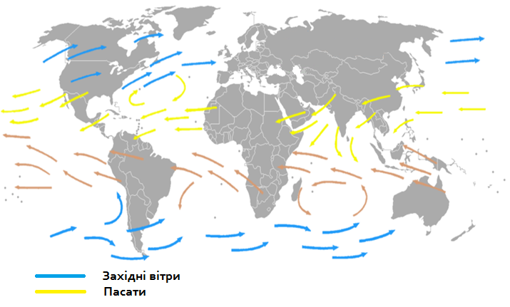

# Пасати

Визначення

<b>Пасати</b> — це постiйнi вiтри, якi виникають мiж тропiчним високим та екваторiальним низьким поясами атмосферного тиску в Пiвнiчнiй i Пiвденнiй пiвкулях Землi.

Завдяки обертанню земної кулі пасати у Північній півкулі переміщуються з північного сходу на південний захід, а в Південній – з південного сходу на північний захід.

