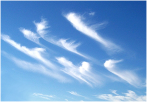

# Перисті хмари

Перисті хмари мають вигляд білих смужок. Вони легкі й прозорі,
складаються переважно з кристаликів льоду, розміщуються на висоті понад
6000 метрів, а тому опади з них на Землю не потрапляють.

Автор: Fir0002

