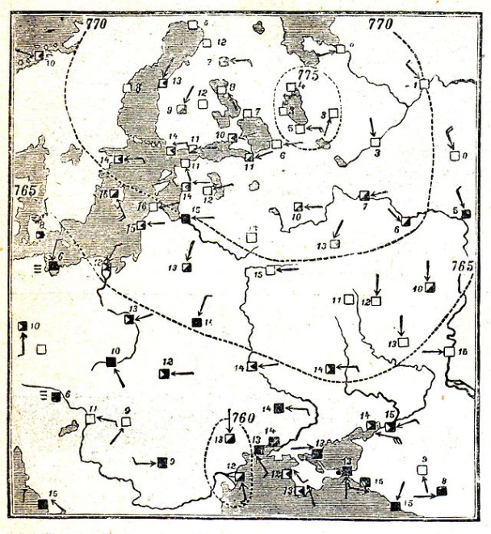

Погода, її елементи, типи, змiна в часi
=======================================

Визначення

<b>Погода</b> — це стан нижнього шару атмосфери в данiй мiсцевостi в
певний момент (або промiжок) часу.

Основними характеристиками погоди є температура повітря, атмосферний
тиск, вітер, вологість, хмари і хмарність, опади, гроза тощо.
Найголовнішою особливістю погоди є її мінливість.

Чинники, які зумовлюють мінливість погоди:

-   Зміна кута падіння сонячних променів протягом доби, місяця, року, що впливає на температурні умови кожної території;

-   Неоднорідність рельєфу та рух повітряних мас;

-   Утворення циклонів і антициклонів.

Розрізняють *періодичні* й *неперіодичні* зміни погоди. Періодичні зміни
погоди пов’язані з рухом Землі навколо своєї осі та навколо Сонця. Це, зокрема, добові та сезонні зміни температури і вологості повітря, напряму вітру. Неперіодичні зміни погоди зумовлені переміщенням повітряних мас, атмосферних фронтів, циклонів і антициклонів.

Визначення

<b>Тип погоди</b> — це загальна характеристика погоди, що включає її
основнi елементи.

За температурними умовами погоду поділяють на три типи:

-   Безморозна

-   З переходом температури через $$0^{\circ}$$С

-   Морозна

Безморозна погода переважає протягом року здебільшого в
еквато-ріальних і тропічних широтах.

Погода з переходом через $$0^{\circ}$$С характерна для перехідних сезонів — весни й осені — і буває лише в помірних широтах.

Морозну погоду спостерігають в помірних і полярних широтах.

Визначення

<b>Метеорологiя</b> — наука про земну атмосферу, явища та процеси,
якi в нiй вiдбуваються. Об’єктом вивчення метеорологiї є метеорологiчнi елементи.

<b>Прогноз погоди</b> — iнформацiя про стан погоди в майбутньому.

Передбачати погоду можна *синоптичними методами* або за *місцевими ознаками*.

Синоптичні — постійні наукові спостереження за станом погоди за
допомогою різноманітних приладів, у тому числі й космічних; складання
*синоптичних карт*, на яких умовними позначками наносять результати
одночасних спостережень за погодою на мережі метеорологічних станцій.

<i>Синоптична карта</i>

За місцевими ознаками — використання народних спостережень за передвісниками змін погоди, народних прикмет.
