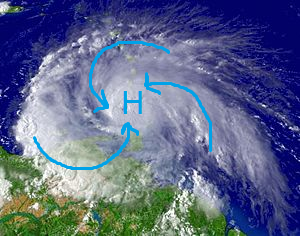
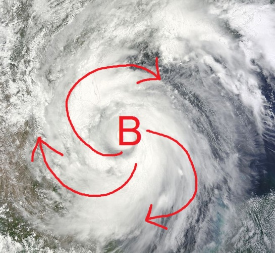

# Повiтрянi маси,циклони та антициклони

Означення

<b>Повiтрянi маси</b> — значнi об’єми повiтря тропосфери з однорiдними властивостями: температурою (теплi та холоднi), вологiстю (сухi
(континентальнi) та вологi (морськi)), тиском, прозорiстю.

Основні типи повітряних мас:
<ul>
<li>Екваторіальні 
(теплі, вологі)
</li>
<li>Тропічні 
(теплі, переважно сухі)
</li>
<li>Помірні 
(температура змінюється за сезонами, переважно вологі)
</li>
<li>Арктичні та антарктичні 
(холодні, сухі, прозорі)
</li>
</ul>

Між повітряними масами з різними властивостями виникають вузькі
перехідні зони з найбільшою різницею температури, тиску і швидкості
вітру – атмосферні фронти. Атмосферні фронти бувають теплі й
холодні.

Теплий атмосферний фронт формується, коли тепле повітря наступає, а
холодне відступає перед ним. Тепле повітря, рухаючись швидше від
холодного, повільно піднімається вгору й охолоджується. При цьому водяна
пара згущується, утворюються хмари, з яких потім випадають тривалі
опади.

Холодний атмосферний фронт формується, коли холодне повітря
рухається в бік теплої повітряної маси. Рухаючись уперед, холодне і
важке повітря підтікає під тепле і витісняє його вгору. З цим фронтом
пов’язані похолодання, утворення купчасто-дощових хмар, грози, зливи.

Циклони — область приземного шару атмосфери з низьким атмосферним
тиском, де вітри дмуть від *периферії до центру*. Завдяки силі обертання
Землі повітря в циклонах Північної півкулі рухається *проти годинникової стрілки*, а в Південній — за нею. У центрі циклону переважає *висхідний рух* повітря, що зумовлює зниження тиску. Підняття повітря сприяє
згущенню водяної пари, утворенню хмар і опадів. 
*Влітку циклон приносить прохолодну, дощову або хмарну погоду, а взимку — підвищення температури, відлигу, опади.*

Антициклони — область *підвищеного* атмосферного тиску, де повітря
розтікається *від центру до периферії.* У центрі антициклону переважає
*низхідний рух* повітря, що зумовлює зростання тиску і підвищення
температури. Завдяки нагріванню повітря поступово стає сухішим, що не
сприяє утворенню хмар і опадів. *Влітку антициклон приносить жарку, ясну погоду, а взимку – холодну, ясну погоду.*

