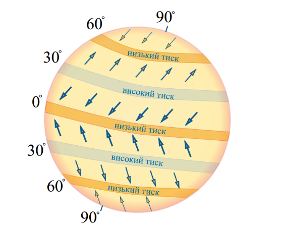

Пояси атмосферного тиску на Землi
=================================

Означення

<b>Атмосферний тиск</b> – сила, з якою повiтря тисне на земну поверхню.

Одиниці вимірювання атмосферного тиску – міліметри ртутного стовпа (мм рт. ст.), Паскалі (Па). За нормальний атмосферний тиск уважають тиск
ртутного стовпа заввишки 760 мм на широті $$45^{\circ}$$ над рівнем моря
при температурі $$0^{\circ}C$$.

Вимірюють тиск за допомогою **барометра**.

Автор: Sch

Повітря тисне на різні ділянки земної поверхні неоднаково. Це можна
пояснити нерівномірним нагріванням поверхні Землі, від якої, в свою
чергу, нагрівається повітря. Отож, атмосферний тиск залежить від
температури повітря. При підвищенні температури тиск знижується, при
зниженні – навпаки.

Від нагрівання повітря розширюється, піднімається вгору і менше тисне на
поверхню. При охолодженні, навпаки, стискається й опускається вниз.
Також важливим фактором є висота над рівнем моря. Із підняттям угору
товщина верхніх шарів атмосфери зменшується, як зменшується й густина
повітря, тому тиск знижується у тропосфері на кожен 1 км підйому на 100
мм ртутного стовпчика. На Землі існують три пояси з переважанням
низького тиску й чотири — з переважанням високого тиску. Їхнє утворення
пов’язане з нерівномірним розподілом сонячного тепла на Землі та
властивістю повітря змінювати об’єм і вагу залежно від температури.

Означення

<b>Iзобари</b> — лiнiї на картi, якi з’єднують точки з однаковим тиском
на земнiй поверхнi.

<quiz>
<question>

Зона якого тиску знаходиться над екватором?

<answer>зона високого тиску</answer>
<answer correct>зона низького тиску</answer>
</question>
<question>

Який з факторів не впливає на атмосферний тиск?

<answer>Температура повітря</answer>
<answer>Висота над рівнем моря</answer>
<answer correct>Характер підстилаючої поверхні</answer>
<answer>Залежить від всіх наведених факторів</answer>
<explanation>Характер підстилаючої поверхні (сніг, рослинність, поверхня води, тощо) має великий вплив на властивості повітряних мас, на їх температуру, вологість і прозорість, а отже, впливає і на рівень атмосферного тиску, що дуже залежить від температури повітря. Головним чином вплив на температуру пояснюється тим, що від характеру підстильної поверхні залежить співвідношення величини сонячної радіації відбитої від поверхні землі і поглиненої нею (світла поверхня відбиває сонячну радіацію, а темна – поглинає). Більш детально про це можна прочитати в 11 главі (<a href="http://geography.ed-era.com/6/rozvyazannyageografichnyh_zadach.html" target="_blank">альбедо</a>).
</explanation>
</question>
</quiz>