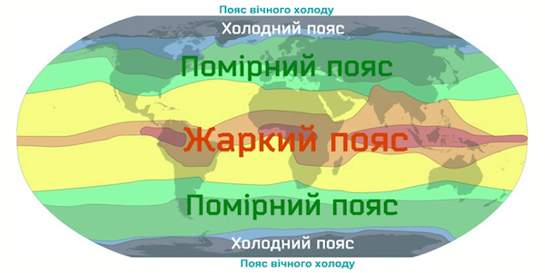

Теплові пояси Землі
===================

Усі процеси в атмосфері відбуваються з участю **сонячної енергії**, але
не всі ділянки земної поверхні отримують однакову її кількість.

Чинники, від яких залежить кількість сонячної радіації:
<ul>
<li>Кут падіння сонячних променів: найбільша кількість сонячних променів над екватором, найменша — за Полярним колом. Так, на екваторі кут падіння сонячних променів сягає $$90^{\circ}$$ у березні і вересні (у дні весняного та осіннього рівнодення) і є дуже великим у грудні та червні (у дні зимового і літнього сонцестояння).</li>
<li>Прозорість атмосфери: хмари, пил, смог, дим зменшують кількість сонячної радіації, що надходить до Землі.</li>
<li>Тривалість світового дня: влітку до районів поблизу полюсів надходить значна кількість сонячної радіації.</li>
<li>Абсолютна висота місцевості: гірські вершини отримують більше сонячної радіації, ніж рівнинні поверхні.</li>
<li>Характер земної поверхні: величина альбедо, рельєф місцевості, океанічні течії. Наприклад, ліс, пісок, розораний вологий темний
ґрунт поглинають більше енергії Сонця і тому нагріваються швидше.
Натомість світлі території, вкриті снігом чи льодом, майже не
нагріваються, оскільки більша частина енергії, що надійшла від
Сонця, миттєво відбивається назад в атмосферу. Вода нагрівається
повільніше, але й повільніше віддає поглинуту енергію.</li>
<li>Відстань від Землі до Сонця: у січні Земля розташована найближче до Сонця і отримує більшу кількість сонячної енергії, на найбільшій відстані — в липні.</li>
</ul>

Означення

<b>Тепловi пояси</b> — умовнi глобальнi областi Землi, що видiляються
за ознакою розподiлу середньорiчних температур повiтря.

Виділення теплових поясів обумовлено нерівномірним розподілом сонячного
тепла по кулястій поверхні Землі. Межі теплових поясів проходять за
умовними лініями — тропіками та полярними колами.

Означення

<b>Тропiки</b> (Пiвнiчний та Пiвденний) — паралелi, що вiддаленi на
$$23^{\circ}27’$$ на пiвнiч i на пiвдень вiд екватора.

<b>Полярнi кола</b> (Пiвнiчне та Пiвденне) — паралелi в Пiвнiчнiй i
Пiвденнiй пiвкулях з широтою $$66^{\circ}33’$$.

Існують спеціальні географічні карти, які показують річний розподіл
температури повітря на Землі. На них температуру повітря позначають або
точками, поряд з якими стоїть її числове значення, або спеціальними
лініями, які з’єднують точки з однаковою температурою, – **ізотермами**.
Червоними лініями позначають температуру найтеплішого місяця року, яким
у Північній півкулі є липень. Чорними або синіми лініями позначають
температуру січня – найхолоднішого місяця у Північній півкулі.

Розрізняють чотири типи річного розподілу температури: *екваторіальний*,
*тропічний*, *помірний* і *полярний*. За особливостями річного розподілу
температури повітря на Землі виділяють сім теплових поясів, межами яких
є ізотерми: *жаркий*, *два помірних*, *два холодни*х і *два пояси
вічного холоду*.

Означення

<b>Iзотерми</b> — лiнiї на картi, якi з’єднують точки з однаковою середньою температурою на земнiй поверхнi.

Автор: Urmas

**Жаркий** розташований з обох боків від екватора між Північним і
Південним тропіками. Земна поверхня отримує багато сонячного тепла й
добре нагрівається завдяки тому, що сонячні промені падають прямо або
під великим кутом. Середньорічні температури: $$+20$$...$$+26 ^{\circ}$$С.

**Помірні** (Північний і Південний) розташовані між тропіками та
полярним колом в обох півкулях. Висота Сонця над горизонтом змінюється
залежно від пори року, що зумовлює велику амплітуду коливань температури
й зміну пір року. Середньорічні температури: $$0^{\circ}$$...$$+25$$
$$^{\circ}$$С.

**Холодні** (Північний і Південний) розташовані за полярними колами в
обох півкулях. Кут падіння сонячних променів мінімальний, частину
променів відбивають льодовий і сніговий покрив, тому на території цих
поясів дуже холодно. Середньорічні температури: нижче за $$0^{\circ}$$С.

**Пояси вічного холоду** (Північний і Південний) розташовані навколо
полюсів і оточені ізотермою $$0^{\circ}$$С найтеплішого місяця в обох
півкулях.

