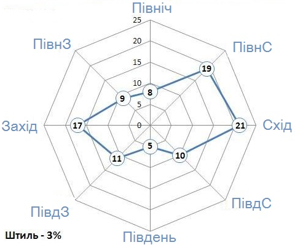
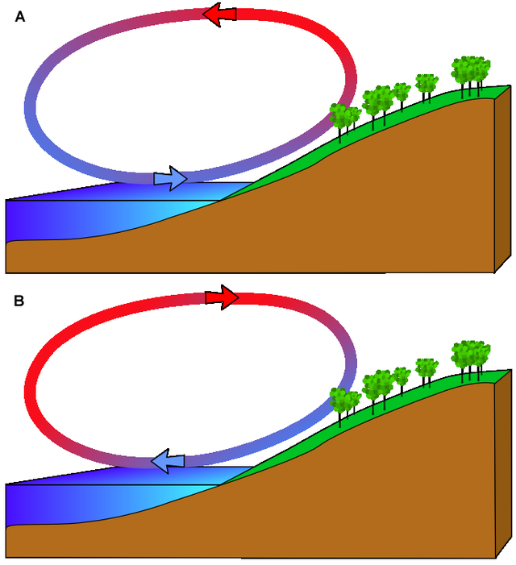

Вiтер, постiйнi та змiннi вiтри
===============================

Означення

<b>Вiтер</b> — рух повiтря iз зони високого атмосферного тиску в зону
низького атмосферного тиску в горизонтальному або близькому до
нього напрямку.

Вітер характеризується швидкістю, силою й напрямом.
Швидкість вітру вимірюють у метрах за секунду
$\left(\dfrac{\text{м}}{\text{с}}\right)$ або в кілометрах за годину
$\left(\dfrac{\text{км}}{\text{год}}\right)$. Силу вітру визначають за
тиском рухомого повітря на предмети. Її вимірюють у кілограмах на
квадратний метр $\left(\dfrac{\text{км}}{\text{м}^{2}}\right)$. Чим
більша різниця в значеннях атмосферного тиску, тим більша швидкість та
сила вітру.

Відсутність будь-яких ознак вітру називають штилем. Напрям вітру
визначають за положенням тієї сторони горизонту, звідки він дме.

Означення

<b>Флюгер</b> — прилад для визначення напряму та, iнодi, швидкостi
вiтру.

Означення

<b>Анемометр</b> — прилад для визначення швидкостi вiтру.

Означення

<b>Роза вiтрiв</b> — дiаграма, яка вiдображає напрями вiтрiв, що переважають у певнiй мiсцевостi.

Довжина її променів пропорційна повторюваності вітрів даного напряму.

Означення

<b>Пасати</b> — це постiйнi вiтри, якi виникають мiж тропiчним високим
та екваторiальним низьким поясами атмосферного тиску в Пiвнiчнiй i Пiвденнiй пiвкулях Землi.

Завдяки обертанню земної кулі пасати у Північній півкулі переміщуються з
північного сходу на південний захід, а в Південній – з південного сходу
на північний захід.

Означення

<b>Захiднi вiтри</b> — постiйнi вiтри, якi дмуть у помiрних широтах.

Місцеві вітри (бриз, фен, бора) дмуть над порівняно невеликою територією
і значно впливають на погоду в даній місцевості.

Означення

<b>Бриз — змiнний вiтер, який дме з добовою перiодичнiстю на узбережжi морiв, великих озер i деяких великих рiчок.

Змінює свій напрям двічі на день. Денний, або морський — бриз рухається
з водної поверхні на суходіл, а нічний, або береговий — з охолодженого
узбережжя суходолу на водойму.

Схема денного (а) та нічного (б) бризу

Автор: Jesús Gómez Fernández

Означення

<b>Фен — теплий i сухий вiтер, що дме з гiр у долини.

<b>Бора</b> — сильний холодний поривчастий вiтер, що дме зi схилiв гiр
до теплого моря.

<b>Мусон</b> — змiнний вiтер, який змiнює свiй напрям двiчi на рiк: взимку дме iз суходолу на океан, а влiтку, навпаки, з океану на суходiл.

Мусонні вітри найкраще виражені на півдні та сході Азії, на півночі
Індійського та заході Тихого океанів. Особливо потужним є азійський
літній мусон. Він містить велику кількість вологи і тепла, з ним
пов’язані рясні опади.
