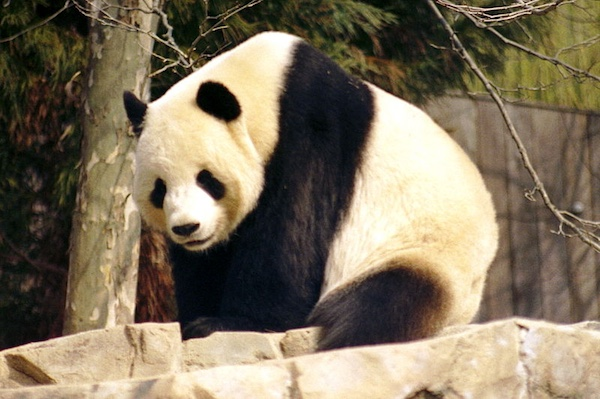

# Вплив господарської дiяльностi людини на бiосферу

**Господарська діяльність** людини поділяється на:

-   сільське господарство

-   промисловість

-   сферу послуг

Господарська діяльність спричинює невідворотні зміни в довкіллі і порушує колообіги речовин. Підраховано, що в середньому кожні півгодини на Землі через руйнування середовища жит-тя вимирає один з видів рослин і тварин. Вирубування лісу та інтенсивне випасання худоби в окремих регіонах Землі спричинили спустелення земель на значних площах. Завдяки осушенню чи надмірному зрошенню ґрунтів розвивається вітрова і водна ерозія.

**Ґринпіс** (Green Peace) — міжнародна природоохоронна організація, яка сприяє екологічному відродженню, привертає увагу людей та влади до збереження природи.

**Всесвітній фонд дикої природи** — міжнародна організація, яка займається збереженням природи, дослідженнями та відновленням природного середовища. Її емблемою є велетенська панда.

