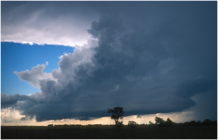

# Види хмар

Перисті хмари мають вигляд білих смужок. Вони легкі й прозорі,
складаються переважно з кристаликів льоду, розміщуються на висоті понад
6000 метрів, а тому опади з них на Землю не потрапляють.

Автор: Fir0002

Шаруваті й шарувато-дощові хмари низькі, потужні, часто мають
сіре чи темне забарвлення і нагадують туман. Ці хмари є змішаними і
складаються як з краплинок води, так і з кристаликів льоду. З них
випадають затяжні дощі, мряка, сніг.

Автор: PiccoloNamek

Купчасті і купчасто-дощові хмари з’являються влітку. Це білі
хмари, які поступово ростуть угору, темніють і можуть розрядитися
зливою.

Автор: Gebruiker:RobotE

