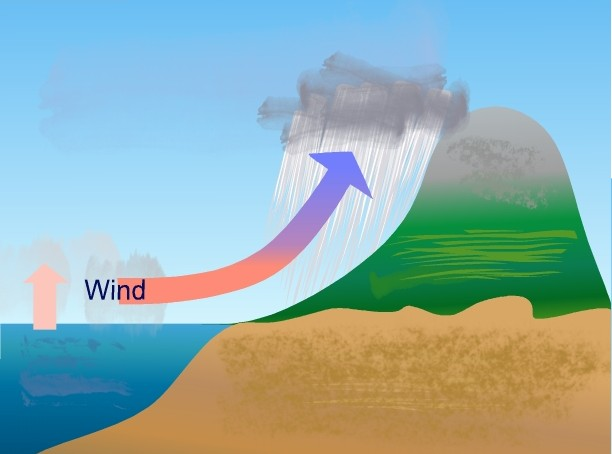

Види опадiв i закономiрностi їхнього розподiлу
=====================================

Означення

<b>Атмосфернi опади</b> – волога, що випадає з хмар або видiляється
з повiтря на поверхню Землi у твердому або рiдкому станах.

<b>Iзогiєти</b> — лiнiї на географiчнiй картi, якi з’єднують точки з однаковою кiлькiстю опадiв.

Кількість опадів вимірюють (в міліметрах або сантиметрах)
за шаром води за допомогою опадомірів різних конструкцій
та плювіографа, який безперервно фіксує зміни інтенсивності дощу.

Основні чинники формування опадів:

-   Висхідний рух повітря

-   Наявність у повітрі достатньої кількості водяної пари для утворення опадів

-   Утворення атмосферного фронту

-   Підвищення рельєфу

Основним постачальником води в атмосферу є Світовий океан, тому над ним
в цілому опадів випадає більше, ніж над суходолом. Біля екватора
випадає найбільша кількість опадів (від 2000 до 3000 мм за рік), адже
там зона низького атмосферного тиску. Переважає *висхідний рух* повітря.
При піднятті теплого насиченого водяною парою повітря воно
охолоджується, конденсується, відбувається механізм утворення дощових
хмар.

<i>Утворення опадів</i>

В тропічних широтах кількість опадів значно зменшується, адже там
атмосферний тиск підвищений. У пустелях випадає менш як 250 мм.
Переважають спадні рухи. Опускаючись, повітря нагрівається, і його
відносна вологість зменшується, хмари не утворюються.

З наближенням до помірних широт кількість опадів збільшується,
оскільки в цій зоні занижений атмосферний тиск, добре розвинуті висхідні
потоки повітряних мас і діють атмосферні фронти й циклони. Так, на
більшій частині Європи випадає від 600 до 1000 мм опадів.

Від помірних і до полярних широт кількість опадів зменшується. Це
зумовлено зниженням температури і вмісту вологи в повітрі та
переважанням низхідних потоків повітря.

У приполярних широтах Північної півкулі зона високого атмосферного
тиску, кількість опадів коливається в межах 150-300 мм за рік. Холодне
повітря важке, зосереджується на поверхні Землі; низькі температури не
дають повітрю «зібрати» багато водяної пари.

У Південній півкулі випадає загалом більше опадів, ніж у Північній,
оскільки в ній переважають водні простори. Але загальні особливості
розподілу опадів тут такі самі, як і в Північній півкулі.

Широтний розподіл опадів на земній кулі порушується через вплив окремих
вітрів, океанічних течій і рельєфу. Так, дуже багато опадів випадає в
зоні дії мусонів. Проте *найбільшу кількість опадів на Землі спостерігають на південних схилах Гімалаїв*. Тут у містечку Черапунджі в
середньому випадає 11 000 мм опадів за рік. Основною причиною цього є
підняття вологого повітря, спричинене наявністю схилів гір. Підсилює
утворення опадів у цій місцевості літній мусон з Індійського океану.

Означення

<b>Дощ</b> — вода, яка випадає з хмар i досягає земної поверхнi у виглядi крапель.

Дощ утворюється при конденсації водяної пари, коли розмір хмарної краплі води перевищує 0,5 мм. Розрізняють слабкі, помірні та сильні (зливові) дощі.

Означення

<b>Снiг</b> — це твердi атмосфернi опади, що випадають iз хмар у виглядi
крижаних кристаликiв.

Сніг утворюється зі снігових хмар при температурі нижчій ніж
0$^{\circ}$С. Крижинки-кристали утворюються тоді, коли водяна пара
швидко охолоджується та переходить із газоподібного стану у твердий,
оминаючи рідкий (сублімація).

Означення

<b>Град</b> — це атмосфернi опади у виглядi сильних крижаних часток
неправильної форми, якi утворюються з купчасто-дощових хмар
при температурi нижчiй за 0$^{\circ}$С.

Крижинки не встигають розтанути й падають із хмар зі значною швидкістю.
Найбільші градини зареєстровані 1986 р. в Банґладеш (до 1,02 кг).

Означення

<b>Туман</b> — вид атмосферних опадiв у виглядi скупчення продуктiв
конденсацiї водяної пари (крапельок води) на поверхнi Землi.

Утворюється безпосередньо з атмосферного повітря при охолодженні повітря
від земної поверхні або при випаровуванні з теплої води в холодне
повітря. Під час туману погана видимість.

Означення

<b>Роса</b> – крапельки води, що утворюються на поверхнi ґрунту й рос-
лин, коли вночi швидко охолоджується поверхня Землi та приземнi
шари повiтря, а водяна пара конденсується.

Іній — тонкий шар кристаликів льоду на земній поверхні. Він
утворюється так само, як і роса, тільки за температури, нижчої від
0$^{\circ}$С. Часто з інеєм плутають паморозь.

На відміну від інею, паморозь — це пухкі білі скупчення кристаликів
льоду, що налипають на гілках дерев, дротах та інших предметах під час сильних морозів і туманів.
