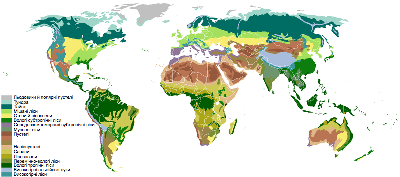
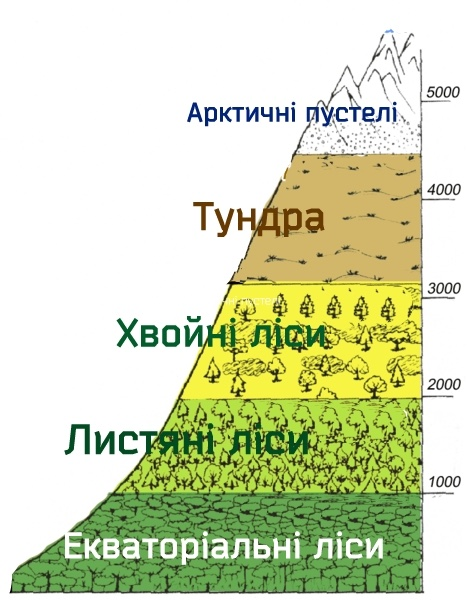

# Зональнi та азональнi природнi комплекси

Визначення

<b>Зональнi природнi комплекси</b> — формуються пiд впливом зональних чинникiв i змiнюються в напрямку вiд екватора до полюсiв (широтна зональнiсть).

Визначення

<b>Географiчнi пояси</b> — найбiльшi зональнi комплекси, що простягаються переважно в широтному напрямку i змiнюються вiд екватора до полюсiв.

Кожному географічному поясу притаманні свої температурні умови та циркуляція атмосфери. Кількість географічних поясів і навіть їхні назви відповідають кліматичним. До визначальних характеристик географічних поясів, крім клімату, належать *ґрунтово-рослинний покрив, особливості внутрішніх* вод тощо.

Визначення

<b>Природнi зони</b> — це меншi за розмiрами зональнi комплекси, що їх видiляють у кожному географiчному поясi.

Вони відрізняються співвідношенням тепла і вологи. У низьких широтах (від $$0^{\circ}$$ до $$30^{\circ}$$) чинником, що визначає особливості зони, є волога (як її нестача, так і надмір), оскільки тепла тут вистачає майже скрізь. У високих широтах (вище $$65^{\circ}$$) розвиток природних умов зони визначає нестача тепла, оскільки опадів тут достатньо для рівня тепла, властивого цим широтам. У різних географічних поясах кількість природних зон і їхні площі різні. Природні зони називають за типом рослинності, що переважає, або за її відсутністю: арктичні пустелі, тундра та лісотундра, мішані ліси, тайга, лісостепи, степи, напівпустелі та пустелі, савани, твердолисті ліси, екваторіальні ліси.

<table>
<thead>
<tr>
<th>Природна зона</th>
<th>Клiматичний пояс</th>
<th>Температура</th> 
<th>Опади</th>
</tr>
</thead>
<tbody>
<tr>
<td>Вологі екваторіальні ліси</td>
<td>Екваторіальний</td>
<td>вище від $$+24^{\circ}С$$</td>
<td>2000-7000 мм</td>
</tr>
<tr>
<td>Перемінно-вологі ліси (мусонні ліси)</td> <td>Субекваторіальний, Тропічний</td>
<td>$$+20$$ ... $$+24^{\circ}С$$ і вище</td>
<td>1000-2000 мм (більша частина влітку)</td>
</tr>
<tr>
<td>Савани і рідколісся</td>
<td>Субекваторіальний, Тропічний</td>
<td>$$+20^{\circ}$$ ... $$+24^{\circ}С$$ і вище</td>
<td>250-1000 мм (більша частина влітку)</tr>
<tr>
<td>Тропічні пустелі і напівпустелі</td>
<td>Тропічний</td>
<td>$$+8$$ ... $$+16^{\circ}С$$ взимку; $$+20$$ ... $$+32^{\circ}С$$ і вище влітку</td>
<td>менше від 250 мм</td></tr>
<tr>
<td>Вічнозелені твердолисті ліси і чагарники (середземноморська)</td>
<td>Субтропічний</td>
<td>$$+8$$ ... $$+16^{\circ}С$$ взимку; $$+20$$ ... $$+24^{\circ}С$$ і вище влітку</td>
<td>250-1000 мм</td></tr>
<tr>
<td>Пустелі та напівпустелі помірного поясу</td>
<td>Помірний</td>
<td>$$-8$$ ... $$24^{\circ}С$$ взимку; $$+20$$ ... $$+24^{\circ}С$$ і вище влітку</td>
<td>менше від 250 мм</td></tr>
<tr>
<td>Степи і лісостепи</td>
<td>Помірний</td>
<td>$$-16$$ ... $$+8^{\circ}С$$ взимку; $$+16$$ ... $$+24^{\circ}С$$ влітку</td>
<td>250-500 мм</tr>
<tr>
<td>Широколистяні ліси</td>
<td>Помірний</td>
<td>$$-8$$ ... $$+8^{\circ}С$$ взимку; $$+16$$ ... $$+24^{\circ}С$$ влітку</td>
<td>500-1000 мм</td>
</tr>
<tr>
<td>Мішані ліси</td>
<td>Помірний</td>
<td>$$-16$$ ... $$-8^{\circ}С$$ взимку; $$+16$$ ... $$+24^{\circ}С$$ влітку</td>
<td>5500-7000 мм</td>
</tr>
<tr>
<td>Тайга</td>
<td>Субтропічний</td>
<td>$$-8$$ ... $$-48^{\circ}С$$ взимку; $$+8$$ ... $$+24^{\circ}С$$ влітку</td>
<td>250-1000 мм</td>
</tr>
<tr>
<td>Тундра і лісотундра</td>
<td>Субарктичний, Субантарктичний</td>
<td>$$-8$$ ... $$-40^{\circ}С$$ взимку; $$+8$$ ... $$+16^{\circ}С$$ влітку</td>
<td>100-250 мм</td></tr>
<tr>
<td>
Арктичні й антарктичні пустелі</td>
<td>Арктичний, Антарктичний</td>
<td>$$-24$$ ... $$-70^{\circ}С$$ взимку; $$0$$ ... $$-32^{\circ}С$$ влітку</td>
<td>менше від 250 мм</td></tr>
<tr>
<td>Тундра і лісотундра</td>
<td>Субарктичний, Субантарктичний</td>
<td>$$-8$$ ... $$-40^{\circ}С$$ взимку; $$+8$$ ... $$+16^{\circ}С$$ влітку</td>
<td>100-250 мм</td>
</tr>
</tbody>
</table>

Означення

<b>Висотна пояснiсть</b> — змiна природних зон у горах залежно вiд висоти.

Це пов’язано з тим, що в гірських районах з висотою знижується температура, змінюється кількість опадів, а отже, і співвідношення вологи і тепла. Чим вищими є гори та чим ближче вони розташовані до екватора, тим більший набір поясів вони мають.

Означення

<b>Азональнi природнi комплекси</b> — формуються пiд впливом особливостей будови земної кори та рельєфу поверхнi.

До найбільших азональних комплексів належать материки і океани. Материки поділяються на великі рівнинні та гірські природні комплекси — **природні країни**.

Україна розміщена в межах таких азональних комплексів: материка Євразія та природних країн — Східноєвропейської рівнини, Кримських гір і Карпат. Її територію перетинають три основні зональні комплекси: мішані ліси, лісостеп і степ.

на материкові Євразія та в природних країнах — Східноєвропейській рівнині, Кримських горах і Карпатах.

Її територію перетинають три основні зональні комплекси: мішані ліси, лісостеп і степ.

<iframe align="center" width="560" height="315" src="https://www.youtube.com/embed/9EAMSxXg-H0" frameborder="0" allowfullscreen></iframe>

