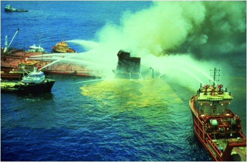

# Забруднення й охорона природного середовища
## Забруднення природного середовища

Означення

<b>Забруднення й охорона природного середовища</b> — насичення навколишнього середовища нехарактерними для нього речовинами.

Забруднення атмосфери полягає у викиді в атмосферу хімічних речовин, твердих частинок і біологічних матеріалів.

Основні забруднювачі повітря:

-   промисловий пил

-   рідини

-   гази

Промисловий пил утворюється в результаті механічної обробки різних матеріалів, транспортування сипких матеріалів та внаслідок теплових процесів.

Рідкі забруднювачі утворюються в процесі конденсації пари, розпиленні і розливі рідин, в результаті хімічних реакцій.

Газоподібні забруднювачі формуються в результаті хімічних реакцій.

Забруднення газоподібними речовинами найчастіше відбувається внаслідок окислення металів, випалювання рудної і нерудної мінеральної сировини на промислових підприємствах. Велика кількість газоподібних сполук утворюється під час спалювання палива. Це оксиди сірки ($$SO_2$$ і $$SO_3$$), азоту ($$NO$$ і $$NO_2$$), вуглецю ($$CO$$), важких і радіоактивних металів. Головна причина забруднення атмосфери — спалювання великої кількості мінерального палива. Забруднювачі повітря прогресували разом з розвитком промисловості. Спочатку це було вугілля, пізніше — нафта й газ. У наш час найбільшим забруднювачем є транспорт. В Україні основним забруднювачем атмосферного повітря є промисловість (65%). Для порівняння, автотранспорт забруднює повітря на 35%. Своєю чергою лідером серед промислових забруднювачів є теплоенергетика (29% всіх викидів). Металургійна промисловість забруднює атмосферу на 25%, а вугільна — на 23%. Найбільша частка викидів припадає на Донецько-Придніпровський регіон — 79% загального обсягу викидів у країні. Одним з небезпечних наслідків забруднення атмосфери є смог.

Види шкідливих речовин в атмосферне повітря у 2009 році (тонн на 1 км$$^2$$)

Автор: tovel

Смог — забруднення повітря, що складається з диму, туману і пилу. З’являється у великих містах і промислових центрах. Загроза смогу полягає в тому, що він викликає алергічні реакції, подразнення слизової оболонки, приступи бронхіальної астми, пошкодження рослинності, будівель, споруд.

Смог над Сантьяґо «Santiago30std». Фотограф Michael Ertel

Забруднення гідросфери:

-   **Механічне забруднення** полягає в підвищенні вмісту механічних домішок (твердих частинок)

-   **Хімічне забруднення** — це наявність у воді органічних і неорганічних хімічних речовин

-   **Радіоактивне забруднення** — забруднення радіоактивними елементами

-   **Теплове забруднення** — випуск у водойми підігрітих вод підприємств, теплових і атомних ЕС

-   **Бактеріальне** і **біологічне забруднення** — наявність у воді різноманітних патогенних мікроорганізмів, грибів і дрібних водоростей

Витік нафти з платформи

Найбільш поширеним є хімічне забруднення. Воно полягає в забрудненні як неорганічними (мінеральні солі, кислоти, луги, глинисті частки), так і органічними речовинами (нафта і нафтопродукти, органічні залишки, поверхнево активні речовини, пестициди). Забруднення прісноводних поверхневих водойм і підземних джерел спричинило нестачу чистої питної води. Нині у світі чиста питна вода недоступна для 1,7 млрд людей, а через 15-20 років їхня кількість сягне 3 млрд осіб. Від вживання забрудненої або зараженої води щороку вмирає 10 млн людей.

## Охорона природного середовища

Означення

<b>Охорона природного середовища</b> — це сукупнiсть заходiв, спрямованих на його збереження та вiдновлення.

Природоохоронні території:

-   Біосферні та природні заповідники

-   Заказники

-   Національні парки

-   Пам’ятки природи

Заповідник Асканія-Нова. Автор 2bpatchett

**Заповідник** — територія, яка повністю зберігається у природному стані і назавжди вилучена з господарського використання. Їх створюють з метою збереження в природному стані типових або унікальних для даної ландшафтної зони природних комплексів; вивчення природних процесів і явищ, що відбуваються в них; розробки принципів охорони навколишнього природного середовища.

**Заказник** — територія, де охороняють окремі природні компоненти і де обмежено дозволене їхнє господарське використання. На відміну від заповідників можуть бути постійними або тимчасовими. У заказниках можливе часткове взяття під охорону тварин, рослин та інших природних ресурсів.

**Національний (природний) парк** — територія, яку охороняють від більшості типів людської діяльності та забруднення. На відміну від заповідників та природних резервацій, де заборонена майже будь-яка діяльність людини, однією з цілей створення національних парків є відпочинок, тому вони дозволяють відвідування туристів та перебування на своїй території за певних умовами.

**Пам’ятка природи** — територія, на якій розташований окремий унікальний природний об’єкт. До пам’яток природи належать, наприклад, унікальні геологічні оголення, печери, водоспади, озера, метеоритні кратери тощо.

### Міжнародні організації

Міжнародні організації поділяють на міжурядові та неурядові.

**Міжурядові** — це об’єднання держав з метою співробітництва заради вирішення проблем, а **неурядові** — громадські об’єднання.

Міжурядові організації:

-   **ЮНЕСКО** — Організація Об’єднаних Націй з питань освіти, науки і культури. Ціль об’єднання – сприяння миру і міжнародній безпеці, співпраці між державами в сфері освіти, науки і культури. ЮНЕСКО реалізовує ряд наукових природоохоронних програм. Наприклад, «Людина і біосфера», «Програма вивчення Світового океану», ЮНЕП, МБП

-   **ЮНЕП** — програма ООН з навколишнього середовища. ЮНЕП займається контролюванням всіх видів діяльності в галузі захисту навколишнього середовища, а також розробляє програми подальших спільних дій у цій галузі

-   **ФАО** — Продовольча і сільськогосподарська організація. Створена 1945 р. ЇЇ основні завдання – це поліпшення харчування і підняття життєвого рівня народів засобами підвищення продуктивності сільського господарства

-   **ВМО** — Всесвітня метеорологічна організація, спеціалізована структура ООН. ВМО займається вирішенням питань забруднення навколишнього середовища, кліматичних змін, забруднення атмосфери.

Неурядові організації:

-   **ВФДП** – Всесвітній фонд дикої природи. Ця міжнародна організація є найчисленнішою та найавторитетнішою неурядовою організацією в галузі охороні довкілля. Цілі – збереження біологічного розмаїття Землі, припинення деградації природного середовища планети

-   **ҐРИНПІС** – міжнародна неурядова організація, створена канадськими захисниками природи. Основне завдання організації — сприяти екологічному відродженню та привертати увагу людей і влади до збереження природи

-   **МСОП** – Міжнародний союз охорони природи, створений з ініціативи ЮНЕСКО. Діяльність МСОП спрямована на реалізацію Вашингтонської конвенції про міжнародну торгівлю дикими видами фауни і флори (CITES). МСОП видає міжнародні Червоні книги, проводить дослідження і популяризацію охорони природи та раціонального природокористування

Країни поширення Ґринпісу. Автор Tappoz

