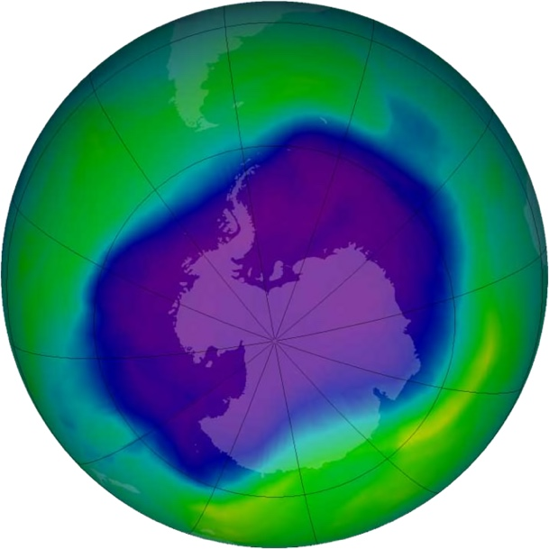
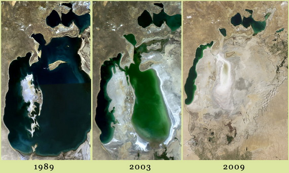

# Змiни компонентiв природи людиною

Означення

<b>Екологiя</b> — наука, що вивчає особливостi функцiонування природи й можливi пiдходи щодо її збереження.

<b>Змiни компонентiв природи людиною</b> — надання компонентам нових рис i властивостей.

До таких змін відносять:

<ul><li>Зміни в атмосфері. Внаслідок господарської діяльності людини збільшується вміст вуглекислого газу в атмосфері. Як ми знаємо, він має властивість затримувати сонячне тепло біля земної поверхні. Це спричинює підвищення температури на всій земній кулі – глобальне потепління або парниковий ефект. Через викиди в атмосферу промислових і побутових відходів та застосування фреонів утворюються озонові діри. Ослаблення озонового шару посилює потік сонячної радіації на землю і викликає у людей зростання числа ракових утворень шкіри. Також від підвищеного рівня випромінювання страждають рослини і тварини.
</ul>

<i>Рис.9.1.1: Озонова діра над Антарктидою</i>

<ul><li>Зміни у літосфері найчастіше відбуваються внаслідок видобування корисних копалин. З цієї причини утворюються численні кар’єри і шахти, терикони. Через утворення пустот у верхній частині літосфери на земній поверхні стаються просідання та провалля. Трапляються такі зрушення і на території України, у Донецькому кам’яновугільному і Дніпропетровському буровугільному басейнах. Рельєф планети також змінюють насипи, спорудження естакад, прокладання численних доріг, шляхів метрополітену тощо.
</li>
</ul>

<ul><li>Зміни у гідросфері. З метою захисту від розливу річок на їх берегах споруджують бетонні огорожі або заточують у труби. Через будівництво водосховищ і шлюзів порушується режим річок, затоплюється велика кількість земель, змінюються умови існування водних організмів, посилюється руйнування ґрунту, частішають випадки зсувів ґрунту.
</li>
</ul>

<ul><li>Зміни у біосфері. Господарська діяльність людини призвела до виникнення нових видів рослин і тварин, повного знищення деяких існуючих видів та їх переселення на нові території. Наприклад, пшениця і кукурудза, капуста і буряки, картопля і перець, огірки і помідори та ще безліч інших рослин у Європу були завезені. Створенням нових видів рослин та тварин займається селекція. Порушення цілісності рослинного покриву внаслідок вирубки лісів, надмірного випасання свійської худоби, забудівлі земель та їх сільськогосподарського використання призводить до втрати представників живої природи (зникає їх звичне навколишнє середовище), прискорення руйнування ґрунтів, відбуваються істотні зміни клімату ( клімат стає посушливішим, посилюється руйнування ґрунтів і, зрештою, наступ пустель). Прикладом помітного зростання площі пустель внаслідок діяльності людини є регіон Аральського моря. Причиною цих наслідків є надмірне використання води з річок Сирдар’я і Амудар’я, які впадають в Аральське море. Озеро почало стрімко всихати, а його колишнє дно перетворюватися на пустелю.
</li>
</ul>

<i>Рис.9.1.2: Зниження рівня Аральського моря за 20 років</i>

