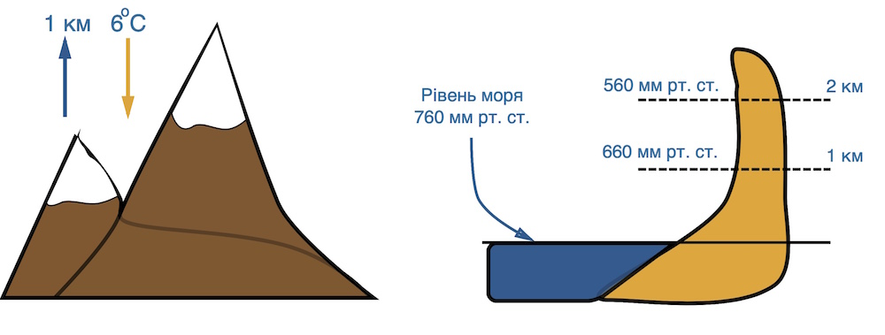

# Тиск

При піднятті на 1 км температура повітря знижується на 6$^{\circ}$С, а атмосферний тиск на 100 мм рт.ст. Із заглибленням <i>t</i> ґрунту підвищується на 3$^{\circ}$С на кожні 100 м. Нормальний тиск (0 м над рівнем моря) = 760 мм рт. ст.

Зміна температури й тиску повітря з висотою

