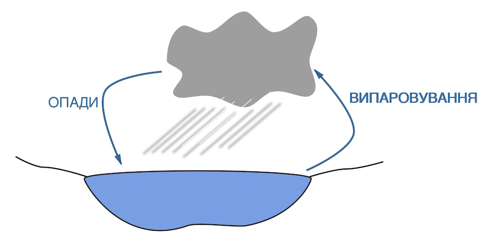

# Зволоження територiї

Означення

<b>Коефіцієнт зволоження</b> – це відношення  кількості опадів, що реально випала,  до випаровування. Вимірюється у відсотках (%).

Розрізняють три типи зволоження території:

* **надмірне** (К>1), коли атмосферних опадів випадає більше, ніж максимально може випаруватися. Наприклад, у тундрі.
* **достатнє** (К=1), коли кількість атмосферних опадів дорівнює максимально можливому випаровуванню. Наприклад, у лісостепу.
* **недостатнє** (К<1), коли кількість атмосферних опадів менша, ніж максимально може випаруватися. Спостерігається в усіх пустелях.

Насичення повітря вологою

<b>Коефіцієнт зволоження</b> = $\frac{\mbox{к-сть опадів}}{\mbox{випаровуваність}}\cdot$100% 

Означення

<b>Відносна вологість</b> – це відсоткове (%) відношення кількості водяної пари, що міститься в повітрі, до тієї максимальної кількості, яка може міститися за даної температури.

<b>Відносна вологість</b> = $\frac{\mbox{к-сть водяної пари в повітрі }}{\mbox{максимальна к-сть пари}}\cdot$100%
