# Умовні позначення

| Зображення | Значення |
| -- | -- |
| 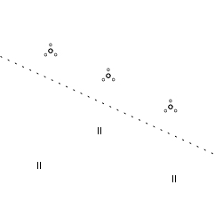 | 1:2 |
| 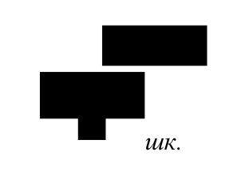 | 1:3 |
| 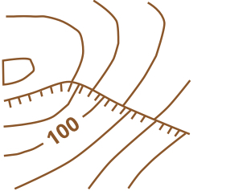 | 1:4 |
| 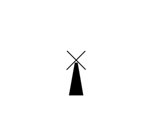 | 1:5 |
| 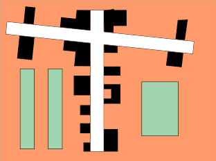 | 1:6 |
| 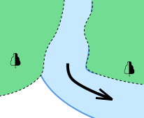 | 1:7 |
| 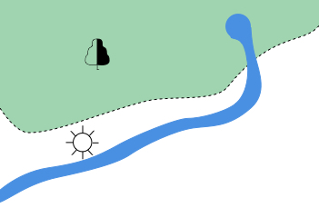 | 1:8 |
| 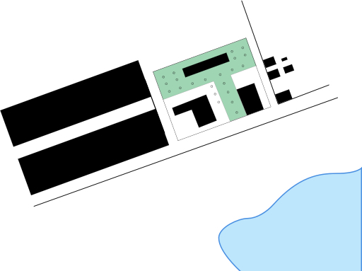 | 1:9 |
| 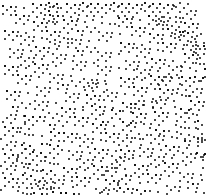 | 1:10 |
| 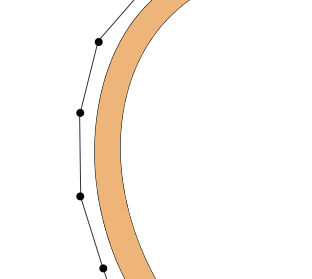 | 1:10 |
| 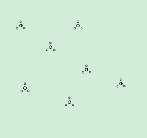 | 1:10 |
| 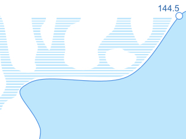 | 1:10 |
| 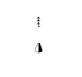 | 1:10 |
| 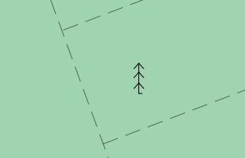 | 1:10 |
| 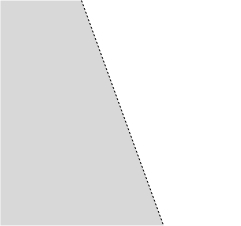 | 1:10 |
| 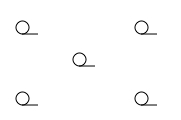 | 1:10 |
|  | 1:10 |
| 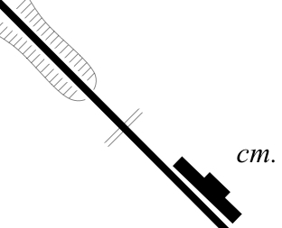 | 1:10 |
| 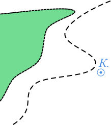 | 1:10 |
| 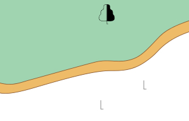 | 1:10 |
| 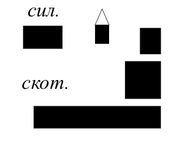 | 1:10 |
|  | 1:10 |
|  | 1:10 |
|  | 1:10 |
|  | 1:10 |
|  | 1:10 |
